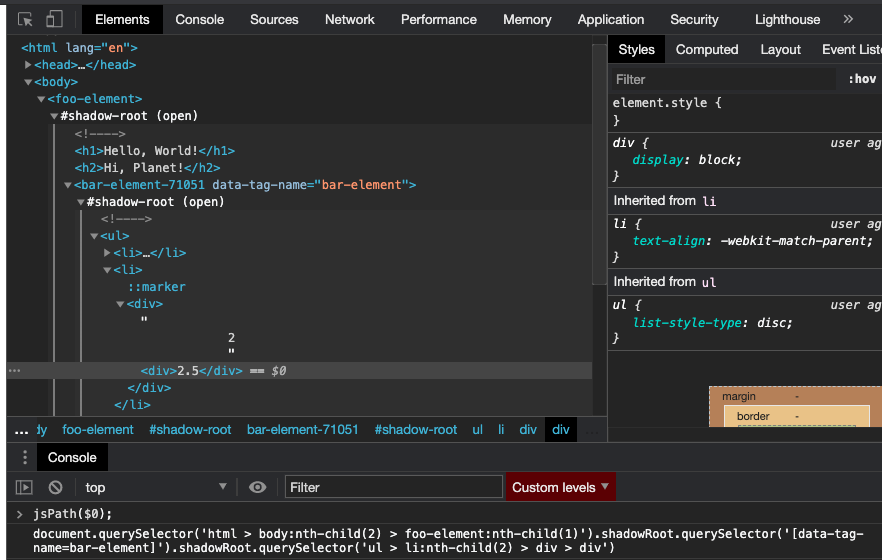

# JSPath

This is a small browser util, similar to the Google Chrome Dev Tools: `Copy -> Copy JS path` menu option when right clicking an element inside the element inspector.

This util is more catered towards tools like scrapers that want a JSPath selector that works on every page reload.

## Features

These features make it different from the chrome dev tools.

- Takes into account [scoped elements](https://open-wc.org/docs/development/scoped-elements), uses `data-tag-name` attribute as selector if one exists, as the tag name changes on each page reload
- Doesn't use any attributes like id, as they can be auto-generted, and change on each page reload
- Just like dev tools, it goes across shadow boundaries

Not implemented:

- Going across iframes

## Usage

```sh
npm i js-path-util
```

```js
import { jsPath } from 'js-path-util';

jsPath(fooElement);
```

Or apply it to the window

```js
import 'js-path-util/src/apply-js-path-to-window.js';

window.jsPath(fooElement)
```

Or copy-paste the [JS from unpkg](https://unpkg.com/js-path-util/dist/apply-js-path-to-window.js) into your Dev Tools console and use it:

```js
jsPath($0)
```

In Chrome Dev Tools in combination with `$0` helper:



## Demo

To see a demo, clone this repository, go into the root folder:

```sh
npm i && npm start
```

The demo also functions as a non-automated smoke test, I can add real tests if this util seems to be useful to people.
